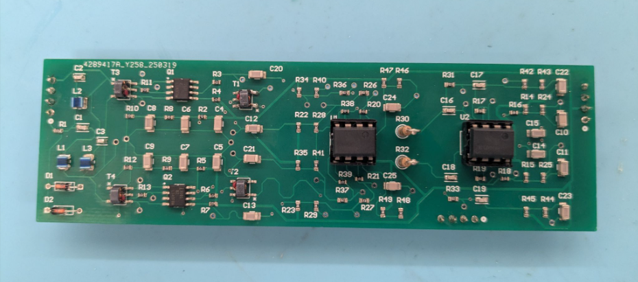
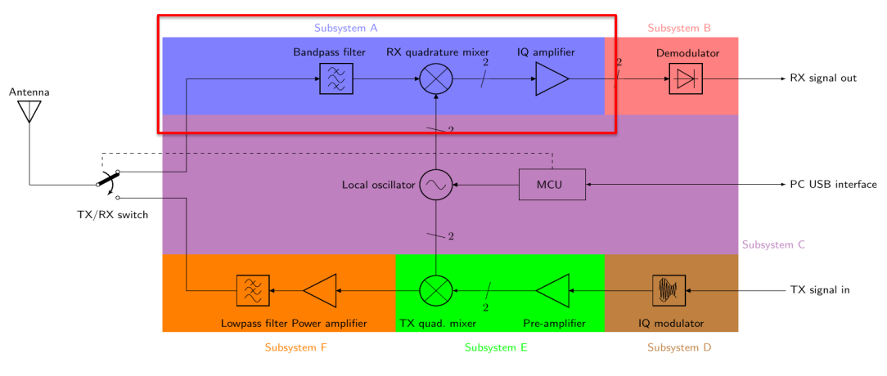
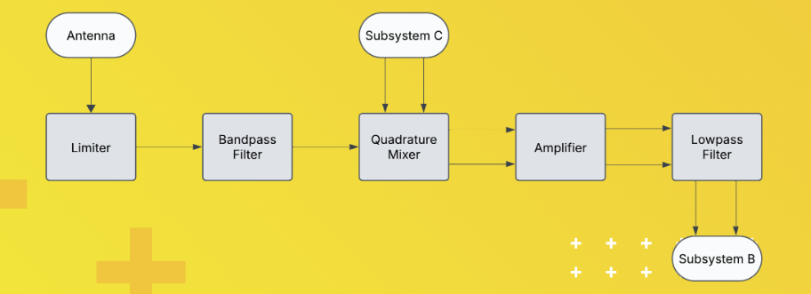
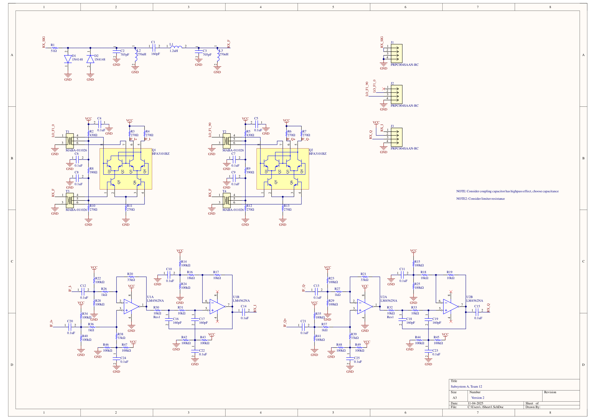
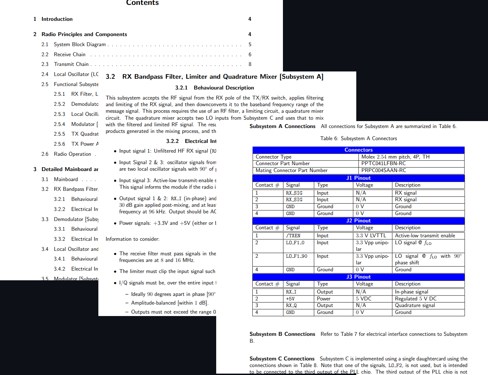
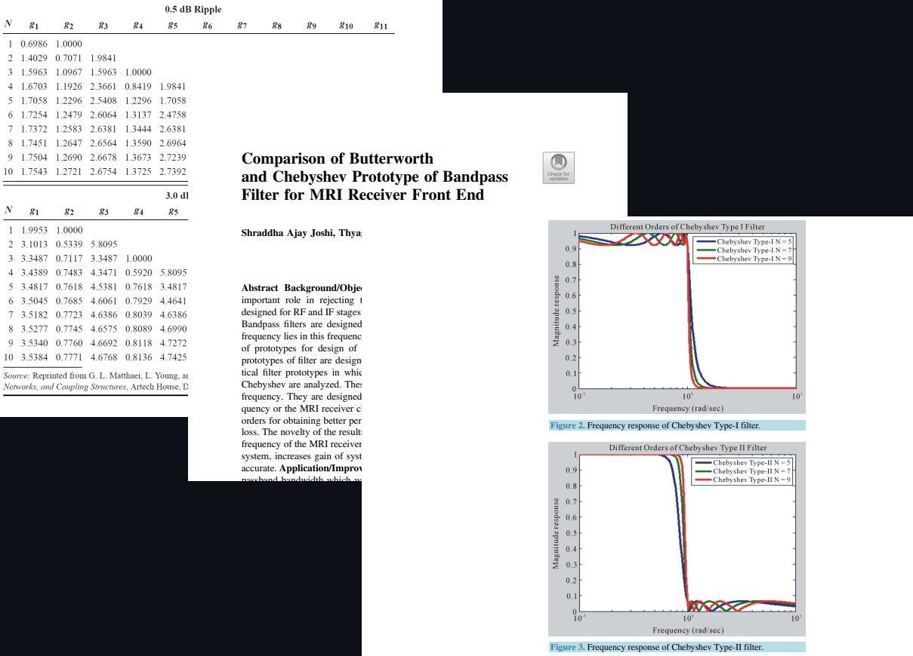

# 📡 flexible-radio-transceiver-input-subsystem

A team hardware project involving custom PCB design for the input stage of a FLRTRX software-defined radio.

# SDR Receiver Front-End (Subsystem A)

Subsystem implemented highlighted in red in high-level diagram below.

Subsystem A implements the RF front-end of a modular software-defined radio. It performs signal conditioning and frequency down-conversion, preparing the antenna input for baseband demodulation in Subsystem B. The fixed-function chain preselects 8-16 MHz, limits large inputs, performs quadrature down-conversion using an external 0 degrees/90 degrees LO, and amplifies the resulting baseband for hand-off to the demodulator.

See subsystem block diagram below.

## Key Specifications
- Passband: 8-16 MHz (3 dB cutoffs)
- Limiter: +/-0.7 V clip level
- Mixer LO: 0 degrees/90 degrees phase, <= 1 dB amplitude error
- IF Path: >= 30 dB gain, <= 96 kHz upper cutoff
- Topology: Reactive LC filters in 50 ohm system

See subsystem schematic below, developed in Altium Designer.

## Block Overview
- Limiter: Protects the mixer by hard-clipping beyond +/- 0.7 V with back-to-back silicon diodes; absorbs transients with minimal distortion.
- Band-Pass Filter: Selects 8-16 MHz band using LC network optimized for 50 ohm match; verified in LTspice for low insertion loss.
- Quadrature Mixer: FST3253 switch-based Gilbert-style mixer driven by 3.3 V p-p LO (0, 90, 180, 270 degrees). Balanced topology cancels LO feedthrough and doubles IF amplitude.
- IF Amplifier: Single-supply op-amp stage (~30 dB gain) biased at 6 V midpoint; linear over full IF bandwidth.
- Low-Pass Filter: 2nd-order Sallen-Key topology; 96 kHz cutoff removes LO and harmonic components.

See automated performance plots generated by rapid, instrument-controlling Python scripts below. Red lines were added to show that design meets ICD requirements.

## Design Improvements, future Refinements
- Balanced differential mixer for common-mode rejection
- Upgraded 2nd-order LPF for cleaner IF output
- Symmetrical PCB layout with matched I/Q trace lengths
- Ground-plane segmentation and controlled trace widths for RF isolation
- Dip-socket resistors and lead-bent components for easier bench debugging

- Fine-tune amplifier gain (< 30 dB) via feedback adjustment
- Add TXEN control for TX/RX switching integration
- Improve thermal relief and shielding in PCB layout

## Tools & Methods
> Design: Altium Designer, LTspice
> Simulation: Transient, AC, FFT analyses
> Hardware: SMD assembly with reflow soldering
> Measurement: Keysight oscilloscope, signal generator, spectrum analyzer

Course project for University of Toronto's ECE295 Hardware Design course. Successfully demonstrates an analog RF front-end performing amplitude protection, frequency selection, quadrature mixing. Board ready for full system integration.

> Keywords: RF front-end, band-pass filter, quadrature mixer, Sallen-Key filter, PCB design, analog signal processing, Python instrument control & automated testing, manual & reflow soldering, Altium Designer, LTspice

See below screenshots of ICD. Central in design process.

See below screenshots of research conducted.

See below picture taken of board testing.

